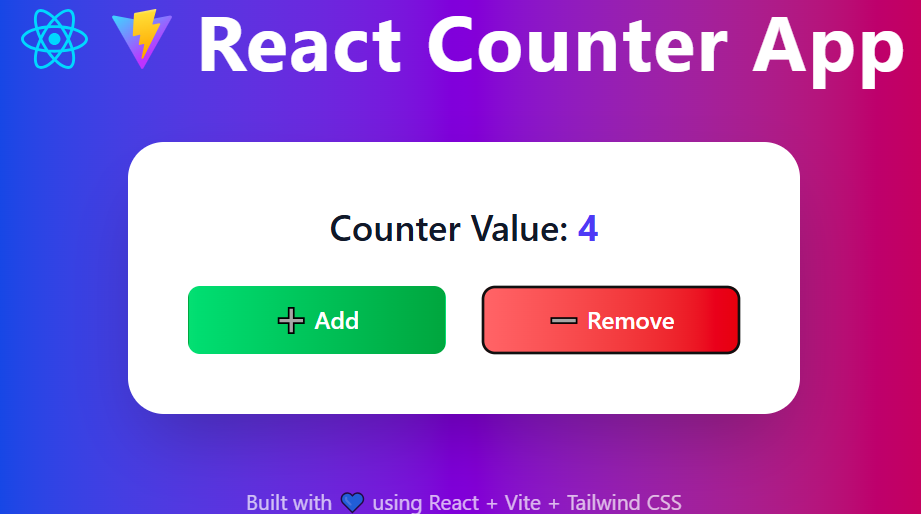

## 🚀 React Counter App

A simple and beautiful full-page counter app built with **React**, **Vite**, and **Tailwind CSS**.
It uses modern React hooks like `useState` and `useEffect`, with a stunning gradient UI and responsive design.

### ✨ Features

- Add / Remove value using buttons
- Counter limits set between 0 and 5
- Stylish gradient buttons with hover effects
- Fully responsive layout
- Built with React + Vite + TailwindCSS

### 📸 Preview



### 🛠️ Tech Stack

- React
- Vite
- Tailwind CSS

### 💻 Run Locally

```bash
git clone https://github.com/your-username/your-repo-name.git
cd your-repo-name
npm install
npm run dev
```
