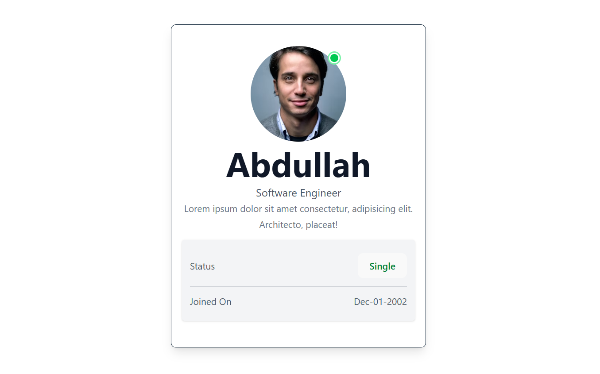

# ReactProfileCard 🧩⚛️

This is a beginner-friendly React project that demonstrates the core concepts of **props** and **hooks** (specifically `useState`) by building an interactive **profile card**. The card displays user details and allows toggling their status between **"Single"** and **"Married"** — along with a dynamic status light indicator (green 🔵 or red 🔴).

## 🚀 Features

- ✅ Uses **React functional components**
- ✅ Implements `useState` hook for local state management
- ✅ Demonstrates **passing props** from parent to child components
- ✅ Uses **conditional rendering and styling**
- ✅ Interactive button to change user status
- ✅ Status light (green or red) updates in real time
- ✅ Built with **Tailwind CSS** for clean UI styling

---

## 🧠 What You'll Learn

- How to pass data using `props`
- How to manage local component state using `useState`
- How to toggle state values on button click
- How to apply conditional CSS classes based on state
- Basic layout and styling with Tailwind CSS

---

## 📁 Project Structure

```

ReactProfileCard/
│
├── public/
│   └── index.html
│
├── src/
│   ├── App.jsx        # Main parent component
│   ├── Card.jsx       # Reusable child component receiving props
│   ├── App.css        # Styling file (optional)
│   └── main.jsx       # Entry point
│
├── package.json
└── README.md

```

---

## 📸 Screenshot

>   
> _The card shows the name, job title, status, and joined date. The light circle in the top-right changes color depending on the status._

---

## 🛠️ Getting Started

### 1. Clone the Repository

```bash
git clone https://github.com/yourusername/PropsAndHooksDemo.git
cd PropsAndHooksDemo
```

### 2. Install Dependencies

```bash
npm install
```

### 3. Run the App

```bash
npm run dev
```

The app should now be running on `http://localhost:5173/`.

---

## 🔧 Technologies Used

- [React](https://reactjs.org/)
- [Vite](https://vitejs.dev/)
- [Tailwind CSS](https://tailwindcss.com/)
- JavaScript (ES6+)
- HTML5/CSS3

---

## 📌 How It Works

### In `App.jsx`:

- A `person` object is defined with user details.
- This object is passed to the `Card` component as a prop (`myDetails`).

### In `Card.jsx`:

- The `useState` hook is used to track the `status` (`Single` or `Married`).
- A button toggles this state.
- The profile card updates the displayed status **and** a status light color (green/red) based on the current state.

---

## ✨ Customization Ideas

- Add more user fields (email, location, etc.)
- Store user status in `localStorage`
- Replace the hardcoded user with dynamic API data
- Animate the status light on change

---

## 🙋‍♂️ Author

**Abdullah Niaz**
Learning React and building fun interactive UIs.
[GitHub](https://github.com/Abdullah-Niaz)

---

## 📃 License

This project is open-source and free to use under the [MIT License](LICENSE).

---

## 💬 Feedback

If you find any bugs or have suggestions, feel free to open an issue or reach out!
