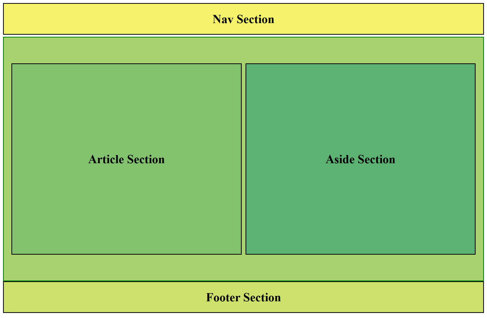

# Vite + React Layout Template

This is a simple React layout template built using **Vite**. The layout includes a basic structure commonly used in modern websites:

## 📐 Layout Structure

- **Navbar** at the top
- A main **section** below the navbar that is divided into:
  - `article` (main content)
  - `aside` (sidebar or additional info)
- **Footer** at the bottom

## 🚀 Getting Started

To run the project locally:

```bash
npm install
npm run dev
```

## 🖼️ Preview



## 🛠️ Tech Stack

- React
- Vite
- HTML & CSS (or any styling used)

---
